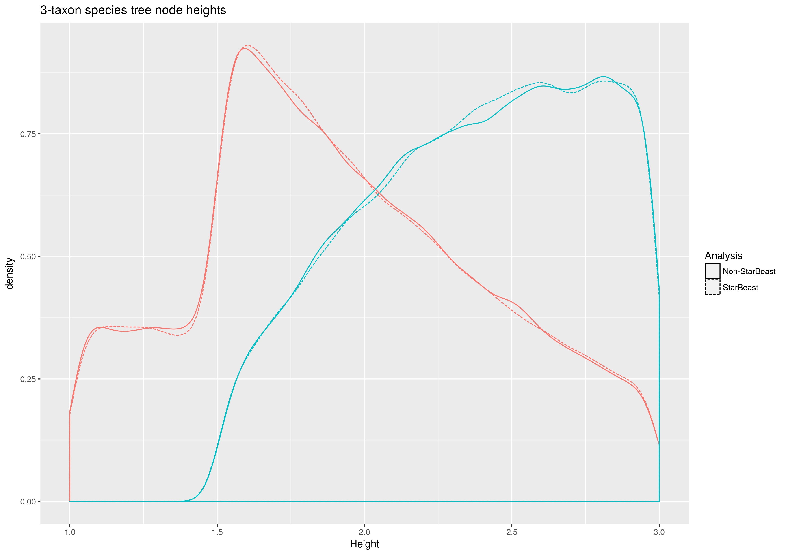
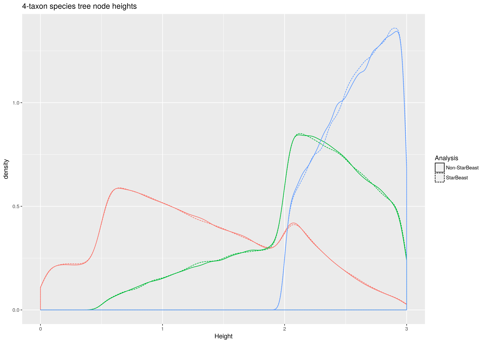
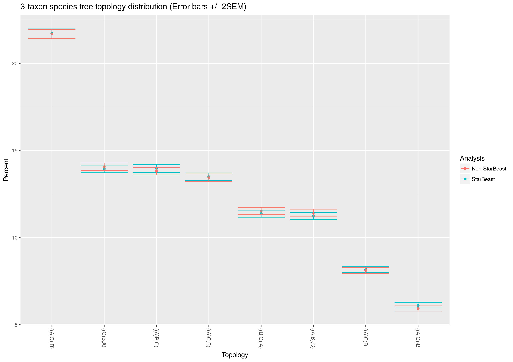
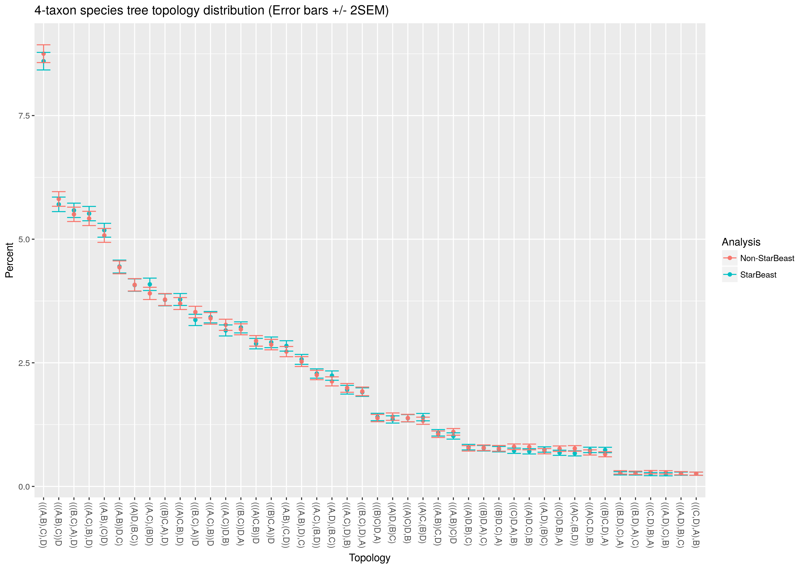
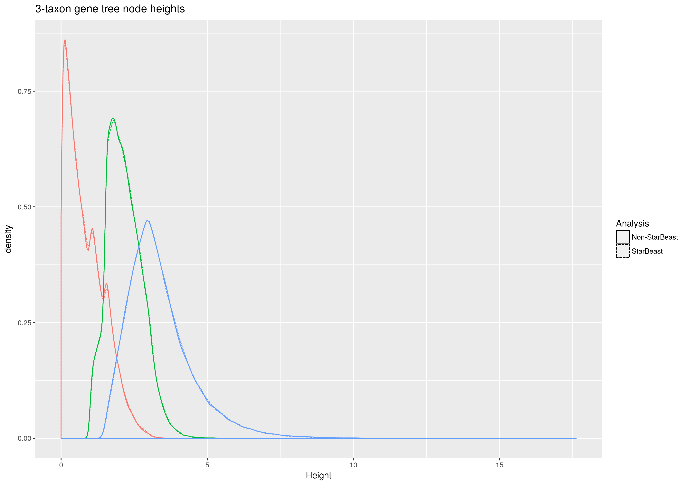
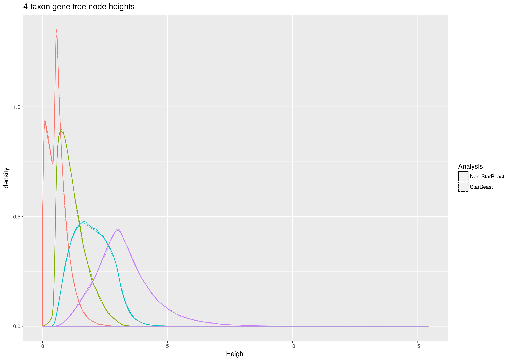
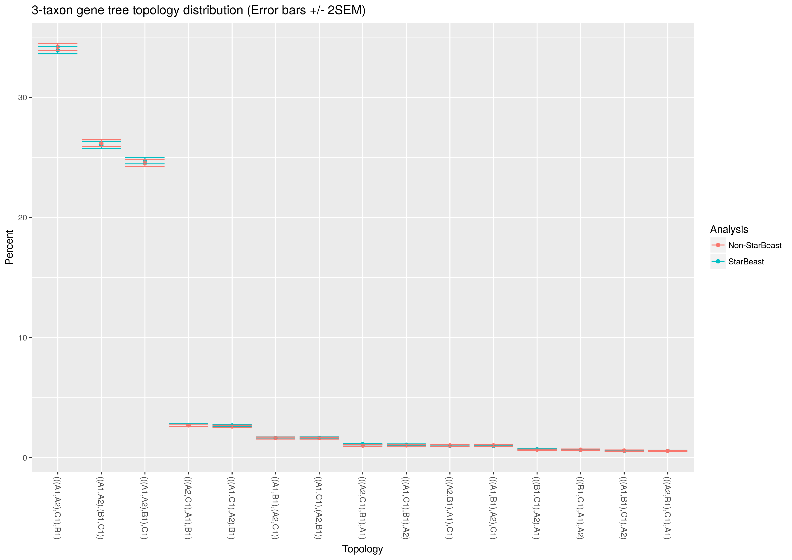
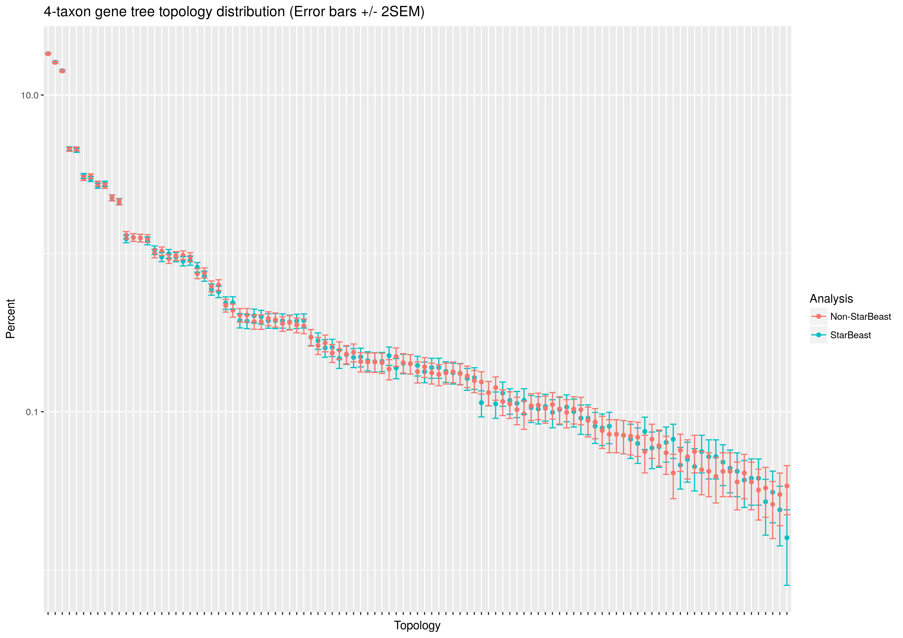

# Correctness of StarBEAST2+SA

StarBEAST2 is almost entirely compatible as-is with sampled ancestor species
trees. The initializer code has been modified to accept a newick species tree
with ancient leaf nodes, and to initialize gene trees with tip dates that
equal species tip dates. To test the correctness of the implementation of the
multispecies coalescent (MSC) given serially sampled species, we compared
simulated gene trees with gene trees sampled from the prior using StarBEAST2.
These comparisons were done for species trees with 3 and 4 sampled taxa, respectively.

To regenerate these figures, run the shell script `run_analyses.sh` and then
the R script `plot_comparisons.R`.  The starbeast2 and SA BEAST packages must
be installed to run the analyses, and the ggplot2 and reshape2 R packages are
needed to produce the figures.

The numerical results used as the basis for the plots are available in the
`*.log` and `*.report` files generated by the analysis script.

## Parameters used to test correctness

Species trees were sampled from a prior distributon using the sampled ancestor
model with the following parameters:

* Origin time = 3
* Birth rate = 1
* Death rate = 0.5
* Sampling rate = 0.1
* Removal probability = 0
* Rho = 0.1
* Population size = 1 (haploid, constant and applied to all branches)

### 3 taxon species trees

For the 3 taxon case, species trees were assumed to be ancestral to taxa sampled
at ages 0 (A), 1.0 (C) and 1.5 (B). A gene was sampled at these taxa, with 2
samples taken at A, 1 at B and 1 at C.  (The gene tree thus has 4 leaf nodes.) 

### 4 taxon species trees

For the 4 taxon case, species trees were assumed to be ancestral to taxa sampled
at ages 0 (A and B), 0.5 (C) and 2.0 (D).

A gene tree was sampled at these taxa, with 2 samples taken at A, 1 at B, 2 at
C and 0 at D.  (The gene tree thus has 5 leaf nodes.)

## Simulating and sampling gene trees

### Simulated gene trees

100,000 sampled ancestor trees were sampled from the above prior
distribution, at a rate of 1 per 1,000 steps in the chain. For every species
tree sample, a gene tree was simulated following the multispecies
coalescent model.

### Sampled gene trees

100,000 sampled ancestor trees and a single embedded gene tree were sampled at
a rate of 1 per 5,000 steps in the chain. The prior distribution on species
trees was the same as for the simulation analysis, and the prior distribution
on gene trees was the multispecies coalescent.

## Visualising correctness

### Species tree node heights

The distributions of node heights for species trees appeared identical, regardless of
whether species trees were sampled independently (for the simulation analysis)
or as part of StarBEAST2. Heights were plotted separately for each node in order
of age (i.e. node height). The heights of tip and sampled ancestor nodes are
excluded. The values incorporated in these density estimates are available in the
`*.speciesNodeHeights.log` files generated by the analysis script.

### Species tree topology counts

The distributions of species tree topology frequencies appeared identical, regardless of
whether species trees were sampled independently (for the simulation analysis)
or as part of StarBEAST2. Topologies were ordered by combined frequency.

### Gene tree node heights

The distributions of node heights for gene trees appeared identical, regardless of
whether species trees were sampled independently (for the simulation analysis)
or as part of StarBEAST2. Heights were plotted separately for each node in order
of age (i.e. node height). The heights of tip and sampled ancestor nodes are
excluded. The values incorporated in these density estimates are available in the
`*.geneNodeHeights.log` files generated by the analysis script.

### Gene tree topology counts

The distributions of gene tree topology frequencies appeared identical,
regardless of whether gene trees were simulated or sampled as part of
StarBEAST2. Topologies were ordered by combined frequency.
