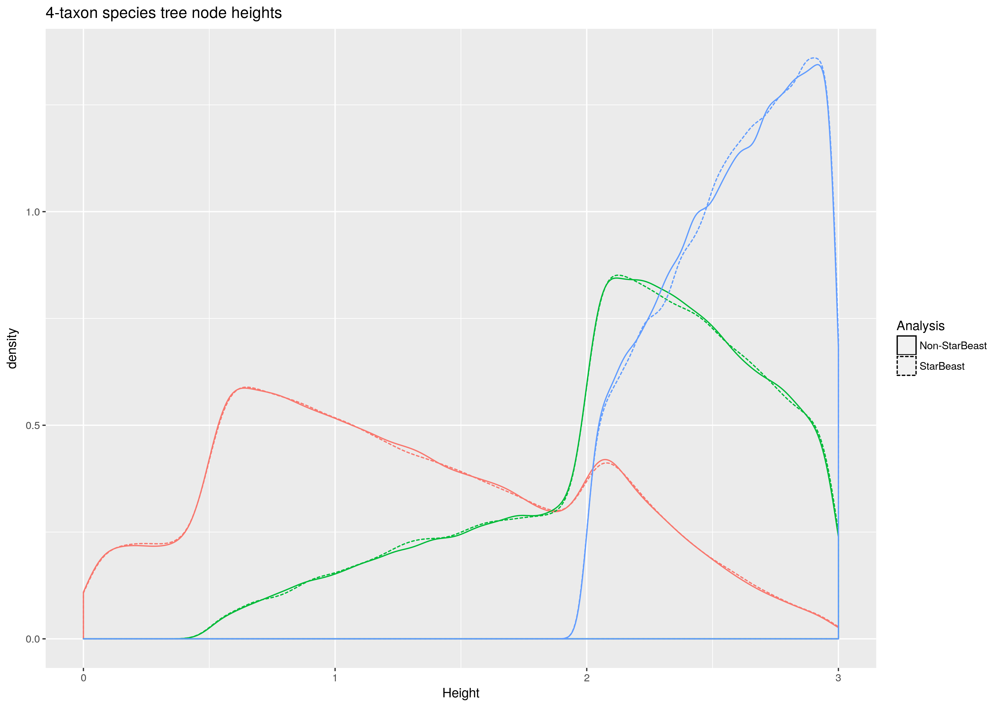
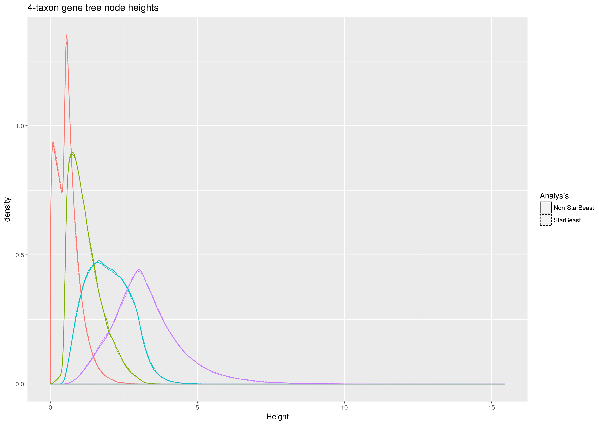
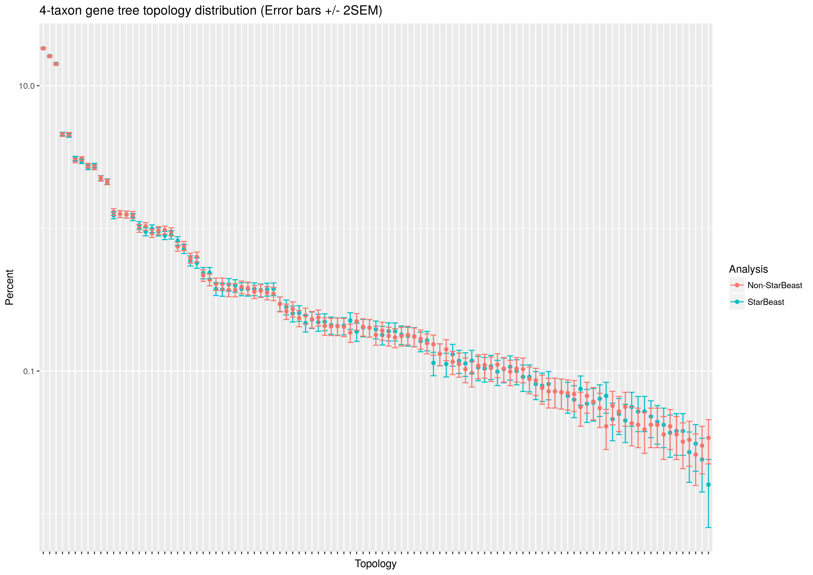

# Correctness of StarBEAST2+SA

StarBEAST2 is almost entirely compatible as-is with sampled ancestor species
trees. The initializer code has been modified to accept a newick species tree
with ancient leaf nodes, and to initialize gene trees with tip dates that
equal species tip dates. To test the correctness of the implementation of the
multispecies coalescent (MSC) given serially sampled species, we compared
simulated gene trees with gene trees sampled from the prior using StarBEAST2.

To regenerate these figures, run the shell script `run_analyses.sh` and then the
R script `plot_comparisons.R`.

## Parameters used to test correctness

Species trees were fixed at four terminal taxa. Two taxa, **a** and **b**,
were fixed at time zero, taxon **c** was fixed at time 0.5, and taxon **d**
was fixed at time 2.0. Species trees were sampled from a prior distributon
using the sampled ancestor model with the following parameters:

* Origin time = 3
* Birth rate = 1
* Death rate = 0.5
* Sampling rate = 0.1
* Removal probability = 0
* Rho = 0.1
* Population size = 1 (haploid, constant and applied to all branches)

Haploid gene trees were fixed at five terminal taxa. Per-species, there were 2, 1, 2,
and 0 terminal taxa for *a*, *b*, *c* and *d* respectively.

## Simulating and sampling gene trees

### Simulated gene trees

100,000 sampled ancestor trees were sampled from the above prior
distribution, at a rate of 1 per 1,000 steps in the chain. For every species
tree sample, a gene tree was simulated following the multispecies
coalescent model. The BEAST XML file for this analysis is
`sampleSpeciesAndGeneTrees.xml`.

### Sampled gene trees

100,000 sampled ancestor trees and a single embedded gene tree were sampled at
a rate of 1 per 5,000 steps in the chain. The prior distribution on species
trees was the same as for the simulation analysis, and the prior distribution
on gene trees was the multispecies coalescent. The BEAST XML file for this
analysis is `sample.xml`.

## Visualising correctness

### Species tree node heights

The distributions of node heights for species trees appeared identical, regardless of
whether species trees were sampled independently (for the simulation analysis)
or as part of StarBEAST2. Heights were plotted separately for each node in order
of distance from the root. The heights of tip and sampled ancestor nodes were
excluded. The script `extract_node_heights.py` extracts the node heights from
each trees output file, and the script `species.nodes.R` plots the distributions.

### Species tree topology counts

The distributions of species tree topology frequencies appeared identical, regardless of
whether species trees were sampled independently (for the simulation analysis)
or as part of StarBEAST2. Topologies were ordered by combined frequency (obviously).

The following command prints topology frequencies for a trees output file:

    appstore SampledAncestorTreeAnalyser -file species.trees -printTopologyCredibleSet true -burnin 0 -credibleSet 100

After compiling both sets of sampled species tree topology frequencies, the script
`species.nodes.R` was used to plot the distributions.

### Gene tree node heights

The distributions of node heights for gene trees appeared identical, regardless
of whether gene trees were simulated or sampled as part of StarBEAST2. Heights
were plotted separately for each node in order of distance from the root. The
heights of tip nodes were excluded. The script `extract_node_heights.py`
extracts the node heights from each trees output file, and the script
`gene.nodes.R` plots the distributions.

### Gene tree topology counts

The distributions of gene tree topology frequencies appeared identical,
regardless of whether gene trees were simulated or sampled as part of
StarBEAST2. Topologies were ordered by combined frequency (obviously).

The following command prints topology frequencies for a trees output file:

    appstore SampledAncestorTreeAnalyser -file gene.trees -printTopologyCredibleSet true -burnin 0 -credibleSet 100

After combining simulated and sampled gene tree topology frequencies, the script
`gene.nodes.R` was used to plot the distributions.
